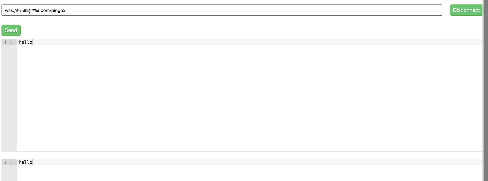
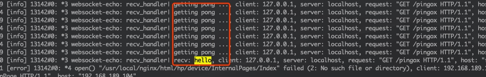

# NGINX-based Websocket Server

## nginx-websocket-module

### Project blog

[http://pingos.io/](http://pingos.io/)

* wss client


* nginx-websocket-module supports wss protocol


## Code sample

**If you want to know how to develop a websocket server, refer to the code in the ['t/ngx_websocket_echo_module.c'](t/ngx_websocket_echo_module.c) .**

## Build

```shell
$
$ git clone https://github.com/nginx/nginx.git
$
$ git clone https://github.com/im-pingo/nginx-websocket-module.git
$
$ cd nginx
$
$ ./auto/configure --add-module=../nginx-websocket-module --add-module=../nginx-websocket-module/t
$
$ sudo make && sudo make install
$
```

## Config file

### websocket

* *syntax* : websocket [any]

* *context*: location

**The switch of websocket service has no args**

```nginx

websocket out_queue=[num] message_length=[num] ping_interval=[time] timeout=[time];

```

#### options

##### out_queue

* *syntax*: out_queue=[num] (default 512)
* *context*: websocket's arg

**Number of out queue**

##### message_length

* *syntax*: message_length=[num] (default 4096000 bytes)
* *context*: websocket's arg

**Max length of websocket message**

##### ping_interval

* *syntax*: ping_interval=[msec] (default 5000ms)
* *context*: websocket's arg

**Time interval between pings**

##### timeout

* *syntax*: timeout=[msec] (default 15000ms)
* *context*: websocket's arg

**receive timeout**

### websocket_echo

* *syntax*: websocket_echo [no args]
* *context*: location

**The server responses the data it received**

```nginx

websocket_echo;

```

### Example nginx.conf

```nginx

daemon on;
master_process on;
#user  nobody;
worker_processes  1;

error_log  logs/error.log  info;

pid        logs/nginx.pid;
events {
    worker_connections  1024;
}


http {
    include       mime.types;
    default_type  application/octet-stream;
    sendfile        on;
    keepalive_timeout  65;

    server {
        listen       80;

        # use wss(ssl)
        listen       443 ssl;
        ssl_certificate /usr/local/nginx/key/im-pingo.crt;
        ssl_certificate_key /usr/local/nginx/key/im-pingo.key;

        server_name  localhost;

        location /im-pingo {
            websocket out_queue=512 message_length=4096000 ping_interval=5000ms timeout=15s;
            websocket_echo;
        }
    }
}

```
